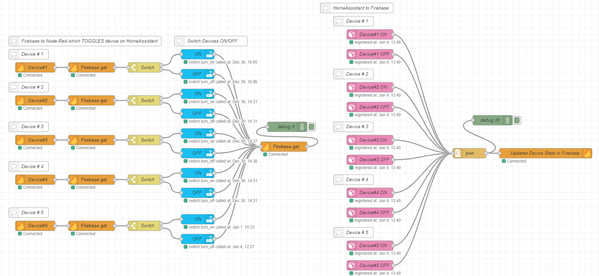
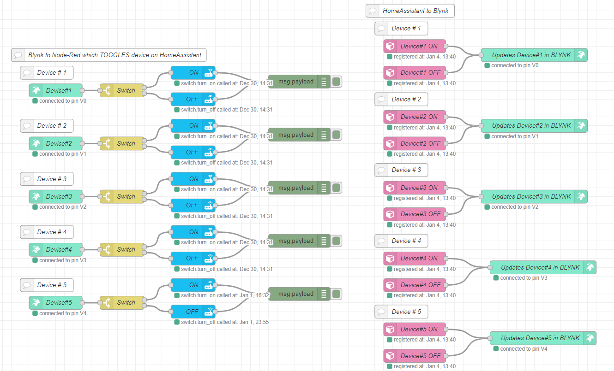
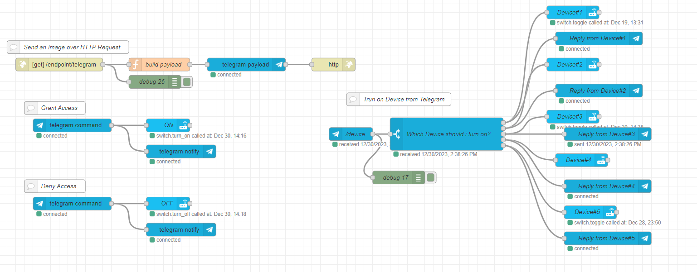
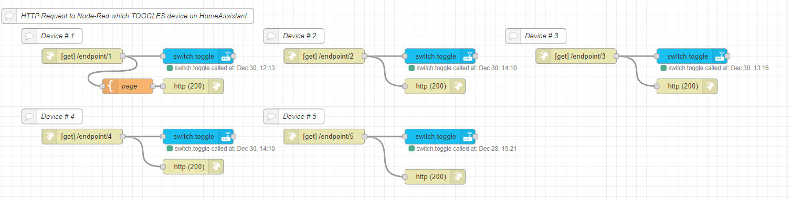

<!-- PROJECT SHIELDS -->
<!-- PROJECT LOGO -->

  <h1 align="center">AMS - “Automated Management Systems”</h1>
<!--     -->

<!-- TABLE OF CONTENTS -->

  
Table of Contents

  <ol>
    <li><a href="#node-red-setup">Node Red Setup</a></li>
    <li><a href="#node-red-configuration">Node Red Configuration</a></li>
    <li><a href="#my-node-red-flows">My Node Red Flows</a></li>
    <li><a href="#references">References</a></li>
    <li><a href="#contact">Contact</a></li>
  </ol>

<!-- Node Red Setup -->
## Node Red Setup

Node-RED is a programming tool for wiring together hardware devices, APIs and online services in new and interesting ways.

It provides a browser-based editor that makes it easy to wire together flows using the wide range of nodes in the palette that can be deployed to its runtime in a single-click.

(<a href="#readme-top">back to top</a>)

<!-- Configuration of the Tuya IoT Platform -->
### Node Red Configuration

You need to install a few new nodes into Node-Red before we start so you click the following link to watch a short video called **["How to install nodes | Node-RED"](https://youtu.be/zXjIZRBWoNs?si=B6tj6JZ69Yc6BDDy)**

**Then Add the following Nodes**
1. **[node-red-contrib-home-assistant-websocket](https://flows.nodered.org/node/node-red-contrib-home-assistant-websocket)**
2. **[node-red-contrib-blynk-iot](https://flows.nodered.org/node/node-red-contrib-blynk-iot)**
3. **[node-red-contrib-telegrambot-home](https://flows.nodered.org/node/node-red-contrib-telegrambot-home)**
      
4. **[@gogovega/node-red-contrib-firebase-realtime-database](https://flows.nodered.org/node/@gogovega/node-red-contrib-firebase-realtime-database)**

(<a href="#readme-top">back to top</a>)

## My Node Red Flows
### Firebase flow

[Click here](./firebase.json)  to get the Json to create this flow 

  

### Blynk flow

[Click here](./blynk.json)  to get the Json to create this flow 

  

### Telegram flow

[Click here](./telegram.json) to get the Json to create this flow 

  

### Devices flow

[Click here](./device.json)  to get the Json to create this flow 

  

(<a href="#readme-top">back to top</a>)

<!-- References -->
## References
The following resources were used in the making of this readme:

1. **[node-red-contrib-home-assistant-websocket](https://flows.nodered.org/node/node-red-contrib-home-assistant-websocket)**
2. **[node-red-contrib-blynk-iot](https://flows.nodered.org/node/node-red-contrib-blynk-iot)**
3. **[node-red-contrib-telegrambot-home](https://flows.nodered.org/node/node-red-contrib-telegrambot-home)**      
4. **[@gogovega/node-red-contrib-firebase-realtime-database](https://flows.nodered.org/node/@gogovega/node-red-contrib-firebase-realtime-database)**

(<a href="#readme-top">back to top</a>)

<!-- CONTACT -->
## Contact
Your Name - Kieron Garvey

Project Link: [https://github.com/ki321g/AMS/](https://github.com/ki321g/AMS)

(<a href="#readme-top">back to top</a>)

