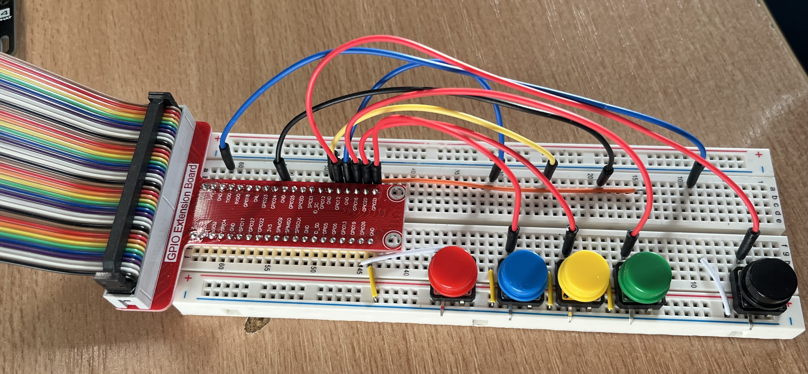
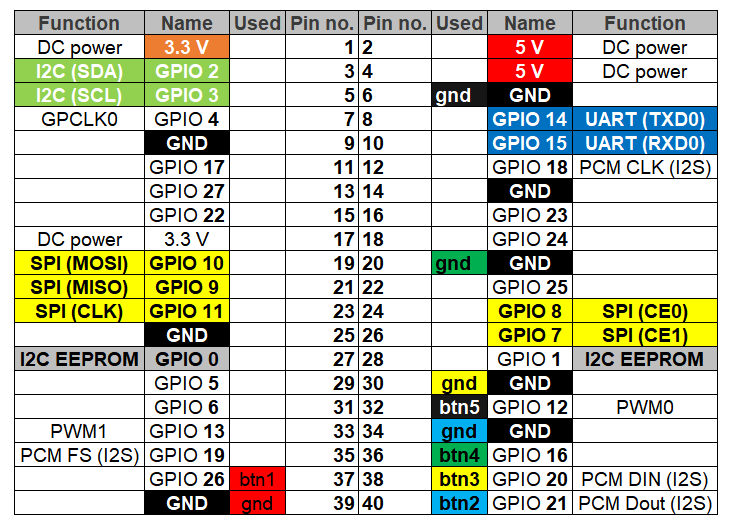

<a name="readme-top"></a>
<!-- PROJECT SHIELDS -->
<!-- PROJECT LOGO -->
<div align="center">
  <h1 align="center">AMS - “Automated Management Systems”</h1>
<!--     -->
</div>
<!-- TABLE OF CONTENTS -->
<details>
  <summary>Table of Contents</summary>
  <ol>
    <li><a href="#facial-recognition">Facial Recognition</a></li>
<!-- Prerequisite Raspberry Pi Setup -->
    <li><a href="#raspberry-pi-breadboard-setup">Raspberry Pi Breadboard Setup</a></li>
    <li><a href="#prerequisite-raspberry-pi-setup">Prerequisite Raspberry Pi Setup</a></li>
    <li><a href="#installation">Installation</a></li>
    <li><a href="#contact">Contact</a></li>
  </ol>
</details>

<!-- Facial Recognition -->
## Facial Recognition
I combined the Raspberry Pi with OpenCV and the python face_recognition library to create a tool for my facial recognition system. 

OpenCV (Open Source Computer Vision Library) is a library of programming functions mainly aimed at real-time computer vision. It provides tools and functions to help with many image processing tasks such as filtering, color manipulation, object detection, and more.

The face_recognition library in Python is built on top of dlib's state-of-the-art face recognition technology that uses deep learning. It simplifies the process of detecting and recognizing faces in images or through a webcam feed.

By using these tools together on a Raspberry Pi, i developed a compact, cost-effective, and efficient facial recognition system. 

I used the Raspberry Pi's GPIO pins to connect a breadboard with 5 buttons one for each of the devices i am settgin up on my system.

I spent more than three weeks trying different things to get facial recognition working on the Raspberry Pi. Watch hundreds of videos and following hundreds of tutorials.

In the end i followed a tutorial from **[@Pysource](https://www.youtube.com/@pysource-com)** and imported his SimpleFacerec (Custom face recognition library) from his tutorial into my application. 

Youtube Tutorial: **[https://youtu.be/5yPeKQzCPdI?si=8T0zXpaAZNMzzHJ4](https://youtu.be/5yPeKQzCPdI?si=8T0zXpaAZNMzzHJ4)**

Blog and Notebook: **[https://pysource.com/2021/08/16/face-recognition-in-real-time-with-opencv-and-python/](https://pysource.com/2021/08/16/face-recognition-in-real-time-with-opencv-and-python/)**


<p align="right">(<a href="#readme-top">back to top</a>)</p>

<!-- Prerequisite Raspberry Pi Setup -->
### Raspberry Pi Breadboard Setup

In order to get teh application to turn on the devices in home assistant and execute parts of the script you need to setup a breadboard with five buttons.

**Breadboard Image**

 

**Breadboard Setup**

 

**Breadboard Setup Tutorial**

I found a two videos on setting up buttons which i watched many times while i was setting it up to ensure i was doing it right. If you have no experience with breadboards follow these videos to setup.your breadboard

Both are from [@m.heidenreich](https://www.youtube.com/@m.heidenreich)

1. **[How to Use Push Buttons With Raspberry Pi GPIO (with Python gpiozero)](https://youtu.be/YICzRCAY73Y?si=2E7IPdAIbPjJkN2j)** 
2. **[How to Use Buttons with Raspberry Pi (Breadboard Tutorial, LED Control)](https://youtu.be/llE5llhJsoE?si=Dlw-gbcZeLAcMezy)**


<p align="right">(<a href="#readme-top">back to top</a>)</p>

<!-- Prerequisite Raspberry Pi Setup -->
### Prerequisite Raspberry Pi Setup

To import all the relevant libraries into your Python script on your Raspberry Pi, you need to install them first. Below you will find a list of the commands I used in my terminal to install these libraries. 

I had to run some of the command with **--break-system-packages** added to the end in order to force them to install properly

Follow these steps to set up and run the website:

1. **Update & Upgrade Raspberry Pi**: First, you need to update & upgrade your Pi:

```bash
sudo apt update -y && sudo apt upgrade -y
``` 

2. **CV2 (OpenCV)**: : This command installs the OpenCV (Open Source Computer Vision Library) package for Python 3. OpenCV is a library of programming functions mainly aimed at real-time computer vision. It's used for tasks such as object detection, face recognition, and many other computer vision tasks:

```bash
sudo apt-get install python3-opencv -y
``` 

3. **pyzbar**: is a Python library to read one-dimensional barcodes and QR codes. It uses the zbar barcode detection library, which means it can handle multiple types of barcodes and QR codes:

```bash
pip3 install pyzbar --break-system-packages
``` 

4. **Opencv-python**: is a library of Python bindings designed to solve computer vision problems:

```bash
pip3 install opencv-python --break-system-packages
``` 
**Note**: This may take some time

1. **face_recognition**: is a simple and easy-to-use library for face recognition tasks. It's built using dlib's state-of-the-art face recognition built with deep learning. The model has an accuracy of 99.38% on the Labeled Faces in the Wild benchmark.:

```bash
pip3 install face_recognition --break-system-packages
``` 

6. **pyautogui**: is a Python module that programmatically controls the mouse and keyboard: 

```bash
pip3 install pyautogui --break-system-packages
``` 

7. **requests**: is a popular Python library used for making HTTP requests:

```bash
pip3 install requests
```  

8. **python-dotenv**:  is a Python library that allows you to specify environment variables in traditional UNIX-like ".env" (dotenv) files. This can be particularly useful in development environments where you might want to keep certain settings, such as database credentials or API keys, out of your code:

```bash
pip3 install python-dotenv
```  

9. **gpiozero**: is a simple interface to GPIO devices with Raspberry Pi. It provides a straightforward way to control devices such as LEDs, buttons, sensors, motors, and other physical components that you can connect to your Raspberry Pi.:

```bash
sudo pip3 install gpiozero
``` 

10. **firebase-admin**: The firebase-admin SDK provides an API that allows you to interact with Firebase from a Python environment.:

```bash
pip3 install firebase-admin
```  

11. **cvzone**: is a computer vision library that includes several utilities to help you with computer vision tasks.:

```bash
pip3 install cvzone
```  

<p align="right">(<a href="#readme-top">back to top</a>)</p>


<!-- Installation -->
### Installation

Follow these steps to set up and run the website:

1. **Clone the repository**: First, you need to clone the repository from GitHub. You can do this by running the following command in your terminal:

```bash
git clone https://github.com/ki321g/AMS.git
``` 

2. **Navigate to the project directory**: After cloning the repository, navigate to the project directory by running the following command:

```bash
cd AMS\FacialRecognition
``` 

3. **Run Application**: Run the following command in the terminal to start the application:

```bash
python3 main.py
``` 
4. **Test Application**: If you have everything setup test your application by pressing one of your breadboard buttons:

    **BTN#1** uses Facial Recognition & QR Code    
    **BTN#2** uses Facial Recognition only     
    **BTN#3** uses QR Code only    
    **BTN#4** uses Facial Recognition only     
    **BTN#5** uses Facial Recognition and sends a requested to Telegram for access approval
      
  


<p align="right">(<a href="#readme-top">back to top</a>)</p>

<!-- CONTACT -->
## Contact
Your Name - Kieron Garvey

Project Link: [https://github.com/ki321g/AMS/](https://github.com/ki321g/AMS)

<p align="right">(<a href="#readme-top">back to top</a>)</p>


