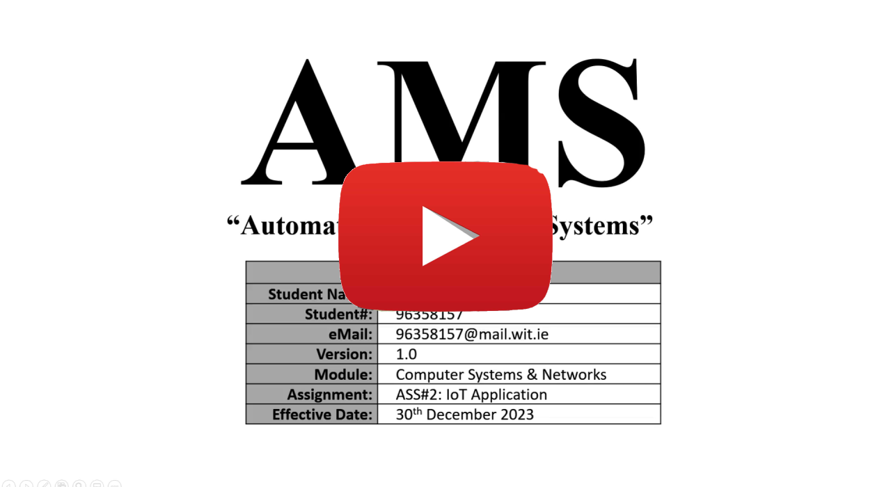

<!-- PROJECT SHIELDS -->
<!-- PROJECT LOGO -->

  <h1 align="center">AMS - “Automated Management Systems”</h1>
<!--     -->

<!-- TABLE OF CONTENTS -->

  
Table of Contents

  <ol>
    <li><a href="#about-the-project">About The Project</a></li>
    <li><a href="#video-walk-through">Video Walk Through</a></li>   
    <li><a href="#setup-steps">Setup Steps</a></li>
    <li><a href="#installation-instructions">Installation Instructions</a></li>
    <li><a href="#references">References</a></li>
    <li><a href="#contact">Contact</a></li>
  </ol>

<!-- ABOUT THE PROJECT -->
## About The Project
The Automated Management Systems (AMS) is an innovative IoT project focused on enhancing security and privacy in a controlled company environment. Addressing the challenge of granting controlled access without compromising sensitive information, AMS introduces a comprehensive solution.

AMS integrates facial recognition and remote access technologies to regulate entry, ensuring only authorized personnel enter the controlled environment. It employs sophisticated security monitoring to restrict access to specific devices, preventing unauthorized usage within the environment.

This system optimizes energy consumption by selectively powering on devices based on user permissions. When multiple individuals are present, AMS requires facial recognition or QR code authentication for device activation, ensuring access control.

Additionally, AMS implements secure login protocols for devices, requiring facial recognition and/or QR code authentication, thereby enhancing security measures within the controlled environment. By providing detailed access control and authentication mechanisms, AMS ensures heightened security and restricted access while optimizing resource utilization.
 

(<a href="#readme-top">back to top</a>)

<!-- VIDEO -->
## Video Walk Through

(<a href="#readme-top">back to top</a>)

<!--
### Setup Steps
TBD - Systsem is not designed yet

(<a href="#readme-top">back to top</a>)

-->

## Installation Instructions

- **Tuya Setup**: Instructions in `TuyaSetup` directory.
- **Raspberry Pi 4 - Home Assistant**: Instructions in `Documentation/HomeAssistant` directory.
- **Raspberry Pi 5 - Facial Recognition**: Instructions in `Documentation/FacialRecognition` directory.
- **Website**: Instructions in `Documentation/Website` directory.

(<a href="#readme-top">back to top</a>)

<!-- References -->
## References
The following resources were used in the devlopment of this project:

1. **[Home Assistant Tuya Integration instructions](https://www.home-assistant.io/integrations/tuya/)**
2. **[Read QR Codes from Raspberry PI with Pyzbar and Python](https://peppe8o.com/read-qr-codes-from-raspberry-pi-with-pyzbar-and-python/)**
3. [Node-RED Cookbook](https://cookbook.nodered.org/#http-endpoints)
4. [Real-time Data Storage with Firebase and Node-RED](https://randomnerdtutorials.com/real-time-storage-firebase-node-red/)
5. [Working with JSON Data And JavaScript Objects in Node-Red](https://stevesnoderedguide.com/working-with-json-data-node-red)
6. [node-red-http-endpoint-examples](https://github.com/rozek/node-red-http-endpoint-examples)
7. [Node-Red HTTP Request Node for Beginners](https://stevesnoderedguide.com/node-red-http-request-node-beginners)
8. [Using a push button with Raspberry Pi GPIO](https://raspberrypihq.com/use-a-push-button-with-raspberry-pi-gpio/)
9. [The Easiest Free Way To Do Home Assistant Remote Access!](https://youtu.be/xXAwT9N-7Hw?si=7lqC9qIAQdTMgROb)

<!-- Research -->
## Research
The following sites/videos/repos were viewed while researching how to create this project but might not have been used within the project:

1. **[Deepface]([https://www.home-assistant.io/integrations/tuya/](https://github.com/serengil/deepface))**
2. **[Object recognition with Python](https://www.aranacorp.com/en/object-recognition-with-python/)**
3. [Raspberry Pi Pinout Guide: How to use the Raspberry Pi GPIOs?](https://randomnerdtutorials.com/raspberry-pi-pinout-gpios/)
4. [Tuya Convert](https://tasmota.github.io/docs/Tuya-Convert/)
5. [SuperHouse #37: Installing Tasmota using Tasmotizer](https://www.youtube.com/watch?v=hIwIhu5OWiA)
6. [SuperHouse 44: Installing Tasmota over-the-air with Tuya-Convert](https://www.youtube.com/watch?v=UZgh5ItPS3k)
7. [Displaying OpenCV Video Feed on HTML Windows using Python](https://copyprogramming.com/howto/python-opencv-video-feed-to-html-windows?utm_content=cmp-true)
8. [Upload Images / Files to Firebase Cloud Storage using Node JS](https://youtu.be/CgMD6VykQXQ?feature=shared)
9. [IoT Application using Node Red & Google Firebase | Raspberry Pi](https://youtu.be/IItfEkeh9cA?feature=shared)
10. [How to Work With JSON in Node-RED](https://www.instructables.com/How-to-Work-With-JSON-in-Node-RED/)
11. [Getting started with Google Coral’s TPU USB Accelerator](https://pyimagesearch.com/2019/04/22/getting-started-with-google-corals-tpu-usb-accelerator/)
12. [My first steps with Raspberry Pi Camera Module 3](https://notenoughtech.com/raspberry-pi/raspberry-pi-camera-module-3/)
13. [Face Recognition With Raspberry Pi + OpenCV + Python](https://www.youtube.com/watch?v=o-x1PE0LVKM)
14. [Face Recognition Based Complete Attendance System with Database and Webpage using PC or Raspberry Pi](https://www.youtube.com/watch?v=qeHXHphI9cg)
15. [Face Recognition Using Opencv & Python | UNKNOWN Face Recognition | KNOWLEDGE DOCTOR](https://www.youtube.com/watch?v=LKPB8YM8awk)
16. [Raspberry Pi and Movidius NCS Face Recognition](https://pyimagesearch.com/2020/01/06/raspberry-pi-and-movidius-ncs-face-recognition/)
17. [Install OpenCV 4 on Raspberry Pi 4 and Raspbian Buster](https://pyimagesearch.com/2019/09/16/install-opencv-4-on-raspberry-pi-4-and-raspbian-buster/)
18. [Face Recognition with OpenCV and Google Coral USB Accelerator](https://codepal.ai/code-generator/query/kBtsUZuc/python-code-for-face-recognition-with-opencv-and-google-coral-usb-accelerator)
19. [Real-Time Face Recognition: An End-to-End Project](https://www.hackster.io/mjrobot/real-time-face-recognition-an-end-to-end-project-a10826)
20. [Build Your Own Face Recognition Tool With Python](https://realpython.com/face-recognition-with-python/#demo)

<!-- CONTACT -->
## Contact

Your Name - Kieron Garvey

Project Link: [https://github.com/ki321g/AMS/](https://github.com/ki321g/AMS)

(<a href="#readme-top">back to top</a>)

