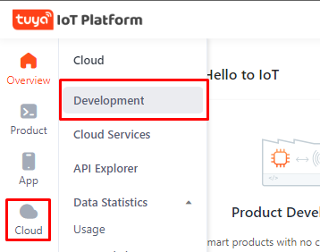
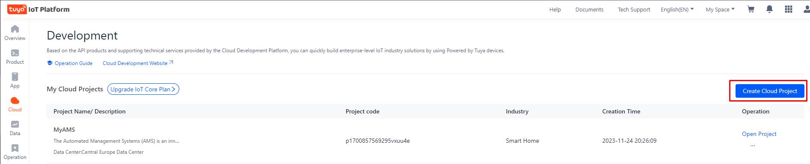
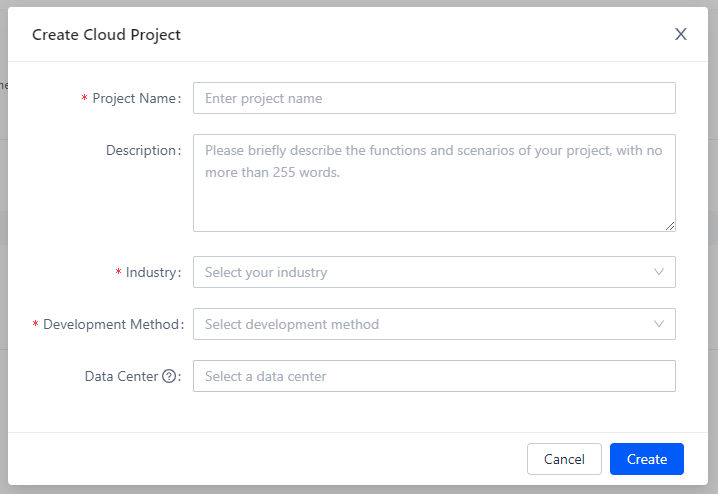
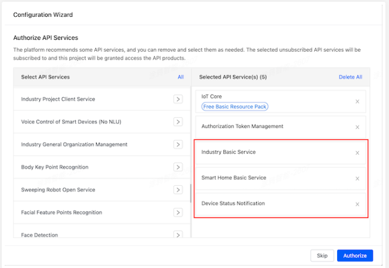
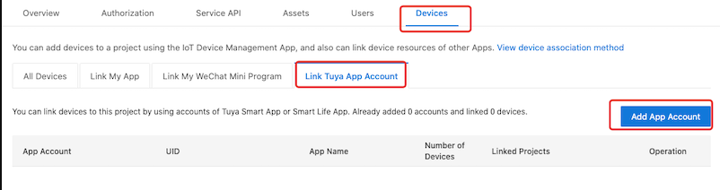
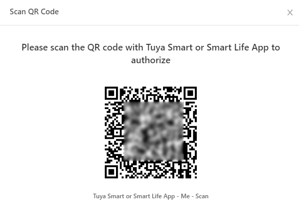
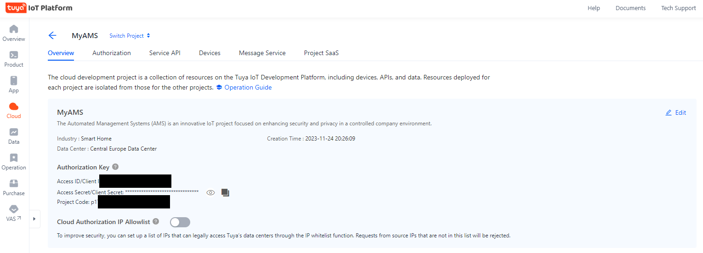

<!-- PROJECT SHIELDS -->
<!-- PROJECT LOGO -->

  <h1 align="center">AMS - “Automated Management Systems”</h1>
<!--     -->

<!-- TABLE OF CONTENTS -->

  
Table of Contents

  <ol>
    <li><a href="#tuya-iot-platform">Tuya IoT Platform</a></li>
    <li><a href="#configuration-of-the-tuya-iot-platform">Tuya Configuration</a></li>
    <li><a href="#references">References</a></li>
    <li><a href="#contact">Contact</a></li>
  </ol>

<!-- Tuya Setup -->
## Tuya IoT Platform

Tuya is a leading IoT (Internet of Things) platform that offers a comprehensive ecosystem for smart home and business solutions. It provides a range of IoT-enabled devices and a robust cloud-based platform that enables seamless connectivity, control, and management of various smart devices.

The Tuya IoT Platform serves as the backbone for developers and businesses, offering tools, APIs, and services to build, integrate, and manage IoT products and applications. It empowers developers to create custom IoT solutions efficiently, utilizing Tuya's extensive library of compatible devices, cloud services, and data analytics to bring innovative smart products to market swiftly

(<a href="#readme-top">back to top</a>)

<!-- Configuration of the Tuya IoT Platform -->
### Configuration of the Tuya IoT Platform

Follow these steps to configure the Tuya IoT Platform:

**PREREQUISITES**

* Your devices need first to be added in the **[Tuya Smart or Smart Life app](https://developer.tuya.com/docs/iot/tuya-smart-app-smart-life-app-advantages?id=K989rqa49rluq#title-1-Download)**.
* You will also need to create an account in the **[Tuya IoT Platform](https://iot.tuya.com/)**. This is a separate account from the one you made for the app. You cannot log in with your app’s credentials.

**CREATE A PROJECT**
1. Log in to the **[Tuya IoT Platform](https://iot.tuya.com/)**.
2. In the left navigation bar, select **Cloud > Development**.

       

3. On the page that appears, select **Create Cloud Project**.
   
       
      
4. In the **Create Cloud Project** dialog box, configure **Project Name, Description, Industry,** and **Data Center**.
   
   * For the **Development Method** field, select **Smart Hom**e from the dropdown list.
   * For the **Data Center** field, select the zone you are located in.
   * Refer to the country/data center mapping list **[here](https://github.com/tuya/tuya-home-assistant/blob/main/docs/regions_dataCenters.md)** to choose the right data center for the country you are in.

       

5. Select **Create** to continue with the project configuration.
6. In the Configuration Wizard, make sure you add **Industry Basic Service, Smart Home Basic Service** and **Device Status Notification** APIs. The list of APIs should look like this:

       

7. Select **Authorize**.

**LINK DEVICES BY APP ACCOUNT**

1. In **Cloud > Development**, open the project that was just created using the link on the far right of the list.
2. Navigate to the **Devices** tab.
3. Select **Link Tuya App Account** > **Add App Account**.

      

4. Scan the QR code that appears using the **Tuya Smart** app or **Smart Life** app using the ‘Me’ section of the app.

      

5. Select **Confirm** in the app.
6. To confirm that everything worked, navigate to the **All Devices** tab.
     * Here you should be able to find the devices from the app.
    * If zero devices are imported, try changing the DataCenter and check the account used is the “Home Owner”. You can change DataCenter by clicking the Cloud icon on the left menu, then clicking the Edit link in the Operation column for your newly created project. You can change DataCenter in the popup window.

  

**GET AUTHORIZATION KEY**

Select the created project to enter the **Project Overview** page and get the **Authorization Key**. You will need these for setting up the integration. in the next step.

  

(<a href="#readme-top">back to top</a>)

<!-- References -->
## References
The following resources were used in the making of this readme:

1. **[Home Assistant Tuya Integration instructions](https://www.home-assistant.io/integrations/tuya/)** 

(<a href="#readme-top">back to top</a>)

<!-- CONTACT -->
## Contact
Your Name - Kieron Garvey

Project Link: [https://github.com/ki321g/AMS/](https://github.com/ki321g/AMS)

(<a href="#readme-top">back to top</a>)

