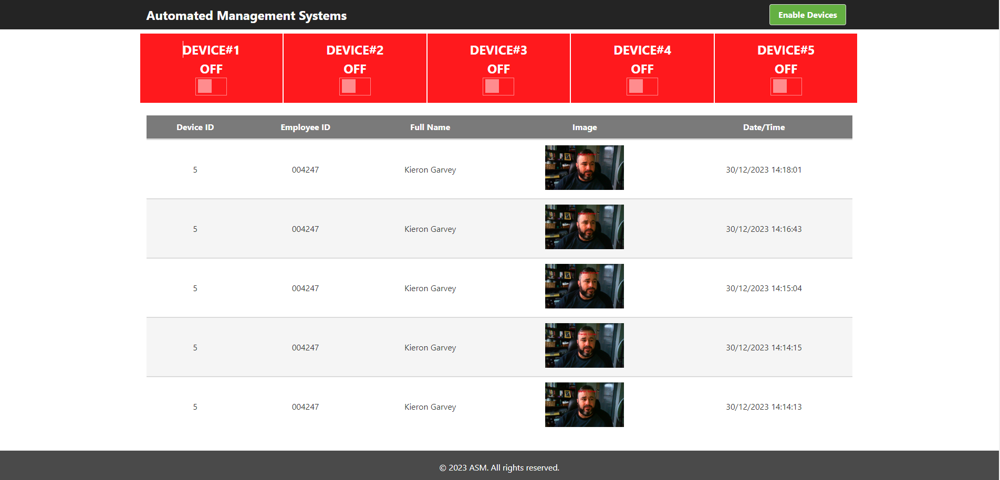

<a name="readme-top"></a>
<!-- PROJECT SHIELDS -->
<!-- PROJECT LOGO -->
<div align="center">
  <h1 align="center">AMS - “Automated Management Systems”</h1>
<!--     -->
</div>
<!-- TABLE OF CONTENTS -->
<details>
  <summary>Table of Contents</summary>
  <ol>     
    <li><a href="#Website-Setup">Website Setup </a></li> 
    <li><a href="#Demo-Web-Application ">Demo Web Application </a></li>
    <li><a href="#installation">Installation</a></li>
    <li><a href="#contact">Contact</a></li>
  </ol>
</details>

<!-- Website Setup -->
## Website Setup 
We assume you have Node.js and Git installed on your system, follow the process below to set up and deploy our web app effortlessly.

<p align="right">(<a href="#readme-top">back to top</a>)</p>

<!-- Demo Web APP  -->
## Demo Web Application 
Visit the following URL to see a running demo of our application.

**URL**: [https://a-s-m.glitch.me/](https://a-s-m.glitch.me/)

<a href="https://a-s-m.glitch.me/" target="_blank">
 
</a>

<p align="right">(<a href="#readme-top">back to top</a>)</p>

<!-- Installation -->
### Installation

Follow these steps to set up and run the website:

1. **Clone the repository**: First, you need to clone the repository from GitHub. You can do this by running the following command in your terminal:

```bash
git clone https://github.com/ki321g/AMS.git
``` 

2. **Navigate to the project directory**: After cloning the repository, navigate to the project directory by running the following command:

```bash
cd AMS\Webite
``` 

3. **Edit the .env file**:  Locate the .env file and update the specified code with your Firebase configuration."

```js
FIREBASE_API_KEY='Firebase_apiKey'
FIREBASE_AUTH_DOMAIN='Firebase_authDomain'
FIREBASE_DATABASE_URL='Firebase_databaseURL'
FIREBASE_PROJECT_ID='Firebase_projectId'
FIREBASE_STORAGE_BUCKET='Firebase_storageBucket'
FIREBASE_MESSAGING_SENDER_ID='Firebase_messagingSenderId'
FIREBASE_APP_ID='Firebase_appId'
FIREBASE_APP_ID_MEASUREMENTID='Firebase_measurementId'
```

4. **Install the dependencies**: The project dependencies are listed in the package.json file. You can install these dependencies by running the following command:

```bash
npm install
``` 
**Note**: This will install all dependencies in package-lock.json

4. **Start the project**: After installing the dependencies, you can start the project by running the following command:

```bash
nodemon app.js
``` 

5. **View Website**: This will load the application and start a local server on port 3000. 
  ```
  http://localhost:3000/
  ``` 

**Note**: If you changed the port in the .env file you will need to use that port instead.

<p align="right">(<a href="#readme-top">back to top</a>)</p>

<!-- CONTACT -->
## Contact
Your Name - Kieron Garvey

Project Link: [https://github.com/ki321g/AMS/](https://github.com/ki321g/AMS)

<p align="right">(<a href="#readme-top">back to top</a>)</p>


